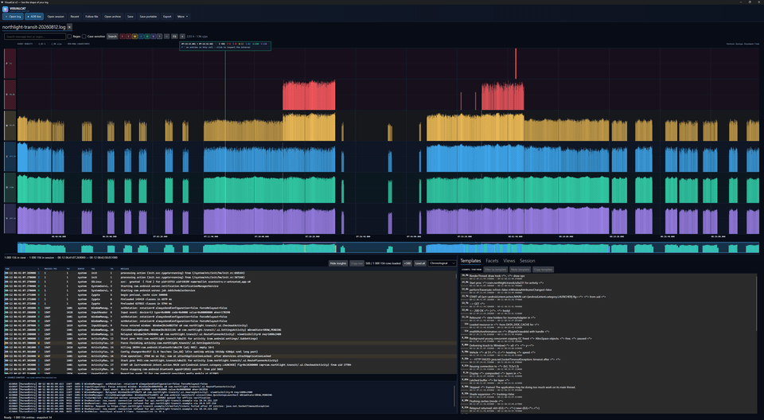
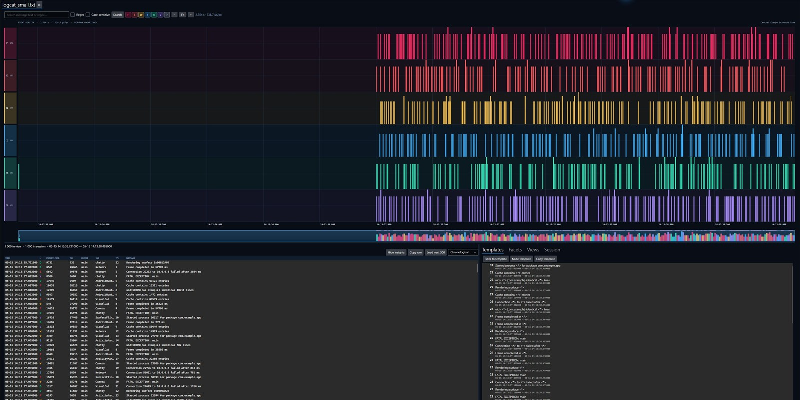
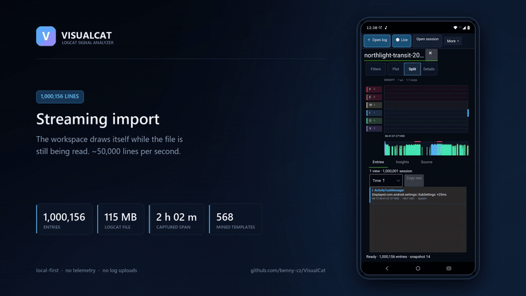
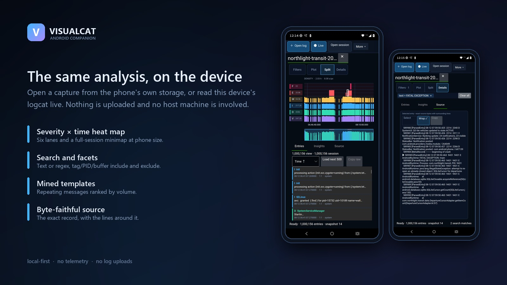

# VisualCat

<!-- Badge policy: only show a badge that reports real, currently available data.
     Codecov is restored by docs/RELEASE-CHECKLIST.md only after a successful
     public report exists for the current main commit. -->
[](https://github.com/benny-cz/VisualCat/actions/workflows/ci.yml)
[](https://github.com/benny-cz/VisualCat/actions/workflows/codeql.yml)
[](https://github.com/benny-cz/VisualCat/releases)
[](LICENSE)
[](global.json)

**See the shape of your log.** VisualCat turns huge Android logcat files and
live `adb` streams into an interactive severity-by-time heat map. Spot crash
storms, error bursts, and quiet gaps without scrolling through millions of
lines. Processing is local, with no telemetry or log uploads.



_A 1,000,156-line capture: the whole two-hour session, a dive into the error
burst, and the exact records behind it. Every image and clip in this repository
uses the same seeded synthetic log — no device-derived or private data is
distributed. It also runs [on the phone](#analysis-on-the-phone)._

> **Status:** `2.0.4` is the current stable release. Download the checksummed,
> self-contained desktop and CLI archives or the release-key-signed Android APK
> from the [latest GitHub release](https://github.com/benny-cz/VisualCat/releases/latest),
> or build from source with the quick start below.

## Try VisualCat

### Quick start from source

Prerequisites:

- The .NET 10 SDK family recorded in [`global.json`](global.json) (`10.0.101` or
  a later installed feature band).
- `adb` from Android SDK Platform Tools only for live host capture.
- PowerShell 7 (`pwsh`) only for the optional packaging script.
- The .NET Android workload only for `VisualCat.slnx` or the Android companion.

Build and test the desktop, CLI, engine, tools, and all tests:

```shell
dotnet restore VisualCat.Desktop.slnx
dotnet build VisualCat.Desktop.slnx --no-restore
dotnet test VisualCat.Desktop.slnx --no-build
```

Open the bundled sample in the desktop app:

```shell
dotnet run --project src/VisualCat.Desktop -- --log samples/logcat_small.txt
```

The complete solution additionally includes Android:

```shell
dotnet workload install android
dotnet build VisualCat.slnx
```

### CLI quick start

Run the CLI directly from source:

```shell
dotnet run --project src/VisualCat.Cli -- index samples/logcat_small.txt --output logcat-small.vcat
dotnet run --project src/VisualCat.Cli -- verify logcat-small.vcat
dotnet run --project src/VisualCat.Cli -- stats logcat-small.vcat
dotnet run --project src/VisualCat.Cli -- query logcat-small.vcat --levels W,E,F --limit 50
dotnet run --project src/VisualCat.Cli -- search logcat-small.vcat "AndroidRuntime"
dotnet run --project src/VisualCat.Cli -- export logcat-small.vcat filtered.csv --type csv
```

Or publish a standalone `vcat` binary into `./bin/vcat`:

```shell
dotnet publish src/VisualCat.Cli -c Release -o ./bin/vcat
./bin/vcat/vcat --version
./bin/vcat/vcat help
```

On Windows PowerShell, invoke the generated executable as
`.\bin\vcat\vcat.exe`. See the [complete CLI reference](docs/CLI.md) for the
full command and export list, including ADB capture and deterministic test-log
generation.

### Release downloads

VisualCat `2.0.4` is available from the
[latest release](https://github.com/benny-cz/VisualCat/releases/latest). Each
stable `v*` tag publishes:

- self-contained desktop and `vcat` CLI archives for Windows x64, Linux x64,
  macOS Intel, and macOS Apple silicon, each containing `LICENSE`,
  `THIRD-PARTY-NOTICES.md`, and a `README.txt` with launch and verification
  steps;
- a `VisualCat.Cli` .NET global-tool `.nupkg` attached to the GitHub release;
- a CycloneDX software bill of materials for the shipped components;
- `SHA256SUMS` plus GitHub build provenance attestations; and
- a release-key-signed Android APK when Android release signing is configured.

NuGet.org publication is not currently configured. After downloading the
`.nupkg` into `./packages`, install that exact release from the local feed with:

```shell
dotnet tool install --global VisualCat.Cli --version 2.0.4 --add-source ./packages
```

Desktop packages are not code-signed or notarized. The
[release notes](docs/RELEASE-NOTES.md) explain the one-time OS prompts and the
[support matrix](docs/SUPPORT.md) records current platform limits.

## What VisualCat gives you

- A zoomable six-severity density timeline and full-session minimap.
- Fast text or regex search, severity filters, facets, templates, and paged
  exact log details.
- File import, growing-file follow mode, host `adb` capture, and Android
  on-device capture.
- Verified local `.vcat` sessions, portable archives, saved views, and
  raw/CSV/report exports.
- Byte-faithful source context and deterministic parsing for `threadtime`,
  `time`, `brief`, `long`, and `epoch` logcat formats.

[](docs/assets/heatmap-analysis.jpg)

## Analysis on the phone

The Android companion is the same engine and the same workspace, sized for a
phone. Open a capture from the device's own storage, or read this device's
logcat live — no cable, no host machine, and nothing leaves the device.



That clip imports a 115 MB, 1,000,156-line capture on the device at roughly
50,000 lines per second, keeps the workspace interactive while it streams, and
then finds the two `FATAL EXCEPTION` records in it.

▶ **[Watch the full 70-second walkthrough](docs/assets/android-demo.mp4)**
— import, heat map, zoom, search, mined templates, facets, and a live capture
(1920 × 1080, 3 MB).



Install the release-key-signed APK from the
[latest release](https://github.com/benny-cz/VisualCat/releases/latest), or build
it with the .NET Android workload:

```shell
dotnet workload install android
dotnet build src/VisualCat.Android/VisualCat.Android.csproj --configuration Release
```

Full-device live capture needs Android's log-access permission. The system asks
for it at the start of every capture, because what it grants is one-time access;
over ADB it can be granted for good:

```shell
adb shell pm grant com.barebit.visualcat android.permission.READ_LOGS
```

## Why not just Android Studio, grep, pidcat, or lnav?

Those are excellent for following a live stream or searching for something you
already know. VisualCat is for exploration: index a multi-gigabyte capture once,
reopen it quickly, see density across all six severities, collapse bursts into
ranked Drain templates, and drill from any timeline pixel back to exact source
records. It complements text-first tools instead of replacing them.

## Technical highlights

- Bounded channel-based ingestion with deterministic ordering, progressive
  manifests, cancellation, and recoverable partial sessions.
- A checksummed little-endian memory-mapped column store with immutable sorted
  segments, stable compaction, string tables, and severity rank bitmaps.
- Pure snapshot queries for heat maps, buckets, facets, statistics, search,
  templates, raw context, and paged details.
- Deterministic, tag-isolated Drain-style message mining.
- Traversal-safe verified `.vcat.zip` transport and review-before-sharing
  diagnostic bundles.
- Cross-platform Avalonia/Skia desktop UI and a reduced Android companion.

Start with [`ARCHITECTURE.md`](ARCHITECTURE.md) for the implemented system. The
original design intent is preserved in [`docs/design/PLAN.md`](docs/design/PLAN.md),
and the individual trade-offs live in 18 [architecture decision records](docs/adr/).

Create the same self-contained desktop and CLI packages locally, including the
notice files that ship inside every release archive:

```shell
pwsh ./tools/package.ps1 -Runtime win-x64,linux-x64,osx-x64,osx-arm64 -Archive
```

Check whether a commit is mechanically ready to package with one command:

```shell
pwsh ./tools/verify-public-release.ps1
```

Coverage is reported for the reusable Domain, Core, Application, Infrastructure,
and CLI layers. UI view-model and headless interaction coverage is also
collected in CI and shown in the downloadable coverage report.

## Roadmap and non-goals

Near-term work focuses on signed/notarized desktop distribution, performance at
tens of millions of entries, and tighter Android release validation. VisualCat
does not aim to become a cloud log service, collect telemetry, replace Android's
debugging stack, or parse every general-purpose log format. iOS unified logs and
desktop syslog formats are outside the v2 scope.

## Documentation

- [Architecture](ARCHITECTURE.md)
- [CLI reference](docs/CLI.md)
- [Keyboard and accessibility](docs/KEYBOARD.md)
- [Session format](docs/SESSION-FORMAT.md)
- [Security model and private reporting](docs/SECURITY.md)
- [Privacy statement](docs/PRIVACY.md)
- [Platform support](docs/SUPPORT.md)
- [Reproducible performance notes](docs/PERFORMANCE.md)
- [Third-party notices](docs/THIRD-PARTY-NOTICES.md)
- [Release checklist](docs/RELEASE-CHECKLIST.md)

## Repository layout

```text
src/       domain, core, application, infrastructure, CLI, desktop, Android
tests/     domain, core, pipeline, and presentation correctness suites
bench/     reproducible ingest and heat-map benchmark harness
tools/     packaging and seeded log-generation utilities
samples/   small deterministic synthetic fixtures and generation instructions
test-data/ sanitized golden parser fixtures
docs/      ADRs, format, privacy, security, support, and release material
```

Contributions are welcome. Start with [`CONTRIBUTING.md`](CONTRIBUTING.md).
Report security issues through the private process in
[`docs/SECURITY.md`](docs/SECURITY.md).

VisualCat is available under the [MIT License](LICENSE). Third-party components
and licenses are listed in [`docs/THIRD-PARTY-NOTICES.md`](docs/THIRD-PARTY-NOTICES.md).
