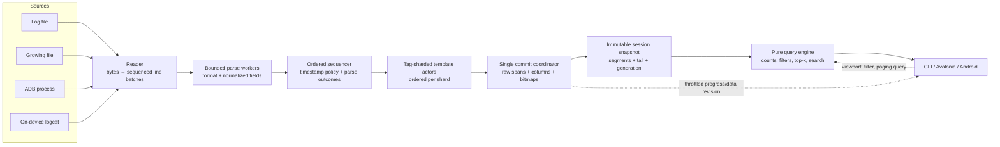
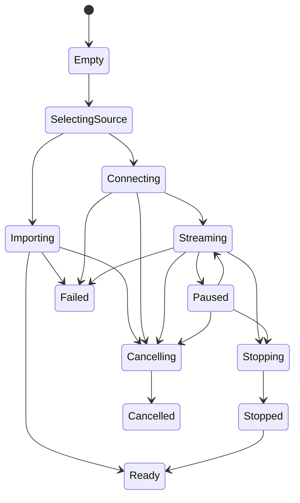

# VisualCat v2 — original design specification (historical)

> This document records the reviewed implementation intent at planning time.
> It is preserved as design history and is no longer the description of the
> working tree. See [`../../ARCHITECTURE.md`](../../ARCHITECTURE.md) for the
> implemented system and the ADRs for individual decisions.

- **Status:** Historical reviewed merge; superseded as implementation documentation by `ARCHITECTURE.md`
- **Product:** VisualCat — a visual analyzer for Android logcat output
- **Implementation model:** Greenfield; the prototype is evidence, not a code base to port
- **Core stack:** C# on a pinned, stable, supported .NET SDK
- **Desktop UI:** Avalonia with a Skia-backed custom timeline
- **Release order:** Windows first; Linux and macOS compatibility maintained and released after validation; Android companion after the desktop product
- **Design scale:** tens of millions of entries and multi-gigabyte captures

This document is self-contained. A team should be able to design, implement, test, package, and evaluate VisualCat v2 without access to the prototype or either source plan from which this specification was merged.

---

## 0. Settled decisions

The following decisions resolve the alternatives considered during planning:

1. VisualCat v2 is designed for multi-gigabyte logs and tens of millions of entries, not only small in-memory captures.
2. The authoritative event index is a custom, memory-mapped, append-oriented columnar session store with rank bitmaps. SQLite is not the primary event store.
3. Aggregation is a pure query over immutable, versioned index snapshots. Zooming never reprocesses entries or mutates previously assigned buckets.
4. The shared desktop UI uses Avalonia and a Skia-backed custom timeline. Windows is delivered and optimized first without coupling the core to Windows.
5. The complete v2 program is deliberately broad: common logcat formats, files, live ADB, session tabs, search, filters, templates, save/reopen, export, desktop cross-platform support, and a later Android companion are all planned deliverables.
6. Breadth does not mean building everything simultaneously. Every milestone is independently testable and demoable, and the Windows desktop application becomes usable before later platform work finishes.
7. Raw source data and original timestamps are never silently discarded or rewritten to simplify indexing. Ambiguity and defects are recorded explicitly.

---

## 1. Executive summary

Android logcat is a high-volume chronological stream spread across severities, processes, threads, tags, and system buffers. Text search is useful when a developer already knows what to seek, but it is weak at exploratory questions:

- When did activity change?
- Which severity dominated a burst?
- What preceded a crash or period of jank?
- Which process, tag, or recurring message pattern caused the change?
- Is the same pattern still occurring on a live device?

VisualCat turns a captured or live log into a severity-by-time heat map. The user sees the shape of an entire session, zooms from hours to milliseconds while preserving the time under the pointer, filters the session, and drills from any visual cell into the exact records it represents. Drain-style message-template mining summarizes recurring behavior so a burst can be understood as a ranked set of patterns rather than a wall of text.

The central architectural rule is:

> The heat map, statistics, templates, and detail rows are queries over one immutable, versioned, time-indexed session snapshot. Viewport and filter changes create new queries; they do not mutate, restore, or rebuild the source data.

This rule gives v2 deterministic counts, exact drill-down, reversible navigation, safe live updates, and testable interaction math.

---

## 2. Product vision

### 2.1 Elevator pitch

**See the shape of your log.** VisualCat turns a saved logcat file, a live `adb logcat` stream, or a permitted on-device stream into an interactive timeline that can be navigated like a map, filtered like a database, and summarized like a report.

### 2.2 Primary users

| User | Situation | Value |
|---|---|---|
| Android application developer | A crash, freeze, or jank episode occurred somewhere in a long capture | Find the time and severity burst, inspect surrounding records, and see dominant templates |
| Platform or device engineer | QA produced multi-GB full-device logs | Index once, reopen quickly, filter subsystems, and compare quiet and noisy periods |
| QA or support engineer | Receives a field log without deep code knowledge | Use templates, facets, and timeline anomalies to perform first-pass triage |
| Developer with a USB device | Needs live feedback while reproducing a bug | Follow the live tail, pause, inspect history, resume, save, and export |

### 2.3 Product goals

VisualCat v2 must:

1. acquire large files and live sources without freezing the UI;
2. normalize records deterministically while preserving raw evidence;
3. make timestamp assumptions and malformed input visible;
4. provide a useful timeline quickly while indexing continues;
5. navigate smoothly from full session to millisecond detail;
6. keep every count consistent across timeline, filters, statistics, and detail;
7. identify recurring message templates deterministically;
8. remain bounded, cancellable, testable, and recoverable;
9. save and reopen indexed sessions without reparsing;
10. keep all processing local unless a future feature is explicitly opted into.

### 2.4 Core user stories

1. Open a logcat file of any practical size and see a growing full-span heat map within seconds while indexing continues.
2. Inspect detected format, timestamp assumptions, parsing defects, source identity, and ingest progress.
3. Zoom with the wheel or pinch around the pointer, pan by dragging, use a minimap, and fit the session.
4. Click a time-by-severity cell and see exactly the entries counted in it.
5. Filter by time, severity, tag, PID, process, TID, template, parsed state, and text or regex.
6. See search hits on the timeline and navigate between them.
7. See the top message templates for the current viewport and filter; include or exclude a template with one action.
8. Connect an ADB device, select buffers, capture live, follow the tail, pause investigation, reconnect, and stop cleanly.
9. Work with several independent sessions in tabs without state leaking between them.
10. Save a session, reopen its index quickly, make it portable when desired, and export a filtered or selected slice.
11. Use a headless CLI to index, verify, query, summarize, and export sessions.
12. Use a reduced Android companion to inspect permitted on-device logs and share a session with the desktop application.

### 2.5 Broad v2 scope

The v2 program includes:

- Windows, Linux, and macOS desktop heads over the same core;
- Windows-first release and optimization;
- an Android companion after desktop maturity;
- captured-file and follow-growing-file modes;
- live host-side ADB capture;
- common logcat formats and timestamp modifiers;
- immutable columnar sessions and instant reopen;
- timeline, minimap, filters, search markers, details, and templates;
- multiple session tabs;
- byte-faithful raw context and export;
- session save, portable session, reopen, versioning, and verification;
- PID-to-process-name tracking for live captures;
- progress, cancellation, diagnostics, privacy, accessibility, and packaging;
- automated correctness, fuzz, UI, performance, and soak tests.

### 2.6 Non-goals

- VisualCat v2 is not a general observability backend or multi-user cloud service.
- It does not modify source logs or device behavior beyond commands required for capture.
- Arbitrary syslog, JSON, and unrelated log formats do not ship in v2, though parser ports remain extensible.
- iOS is not a target.
- Cross-session template identity, multi-file time merge, anomaly detection, and semantic event-buffer decoding are future work unless promoted through a new decision.
- The Android companion is not expected to match the scale or full workspace density of the desktop product.

### 2.7 Release strategy

The scope is broad but released in layers:

1. headless core and CLI;
2. usable Windows desktop file analysis;
3. full filtering, search, templates, save/reopen, and export;
4. live ADB;
5. Linux and macOS packaging and validation;
6. Android companion.

Later deliverables must not destabilize or block an already useful Windows desktop release.

---

## 3. Fundamentals extracted from the prototype

### 3.1 Ideas to preserve

- A severity-by-time heat map reveals structure that plain text hides.
- Fatal appears at the top and Verbose at the bottom.
- Time resolution must span milliseconds through hours.
- Zoom should preserve the pointer or gesture focus.
- A cell must drill into its precise source records.
- Template mining should be a first-class analytical view, not unused background work.
- Files, ADB, and on-device sources benefit from one asynchronous source contract.
- File import and live capture have different completion and progress semantics.
- Background work and batched publication are required for large inputs.
- Sparse periods should remain visible without allocating one object per empty time bucket.

### 3.2 Binding engineering rules

| ID | Rule | Failure prevented |
|---|---|---|
| R1 | No per-line tasks, UI dispatches, or public events | Scheduler overload, UI freezes, and unbounded work |
| R2 | Every queue, cache, batch, and live retention policy is bounded | Memory growth under large or fast sources |
| R3 | Aggregation is a pure query over a snapshot | Reaggregation races and count changes after zoom |
| R4 | The UI never waits with sleeps or retry loops | Timing-dependent behavior |
| R5 | One canonical severity enum and one display mapping | Cross-layer row/index mismatches |
| R6 | Every source creates a fresh session scope | Cross-session state contamination |
| R7 | Platform workarounds stay behind platform ports | Native interop inside presentation logic |
| R8 | One stable custom canvas owns rendering and input transforms | Control recreation, resize bugs, and lost gestures |
| R9 | Interaction math is pure and property-tested | Pointer drift and incorrect hit testing |
| R10 | No raw input disappears silently | Lost stack traces and misleading parse counts |
| R11 | No trace logging inside parse, query, or frame loops | Diagnostics becoming the performance bottleneck |
| R12 | The core runs headlessly and ships with a CLI harness | UI-only validation and untestable domain behavior |
| R13 | Presentation collections are not the session store | Million-row UI objects and duplicated memory |
| R14 | Navigation passes session identity, not live source objects | Ownership and lifecycle ambiguity |
| R15 | Stale asynchronous results are rejected by generation | Old viewport data overwriting new state |

### 3.3 Product and data invariants

1. Each source line has a stable session sequence number.
2. Each accepted normalized event has an immutable session-local identity.
3. Original timestamp text, inferred instant, and inference provenance remain distinguishable.
4. Source order is preserved independently from chronological order.
5. A time interval is half-open: `[startInclusive, endExclusive)`.
6. Each timestamp belongs to exactly one cell for a declared alignment and width.
7. A cell count equals the number of detail records returned for that cell under the same filter and snapshot.
8. Zoom and filter operations never change underlying records, timestamps, or templates.
9. Repeating an import with the same bytes and settings produces an equivalent session.
10. A query result identifies both the session snapshot generation and filter generation it represents.
11. Source EOF, downstream drain, session finalization, and UI readiness are separate states.
12. Cancellation is terminal for that coordinator generation and cannot affect a newer session.
13. No viewport operation resizes the application window.
14. No out-of-order record is made “correct” by silently clamping its original timestamp.
15. Every input byte is attributable to a parsed record, a recognized meta record, or a recorded unknown/rejected span.

---

## 4. Android logcat domain reference

### 4.1 Severities

Canonical storage order:

```csharp
enum LogLevel : byte
{
    Verbose = 0,
    Debug = 1,
    Info = 2,
    Warn = 3,
    Error = 4,
    Fatal = 5,
    Unknown = 255
}
```

`S`ilent is a filtering threshold rather than an emitted event. `A`ssert may be accepted as an alias for Fatal. The UI maps storage order to the display order Fatal, Error, Warn, Info, Debug, Verbose exactly once.

Entries whose level field cannot be interpreted are stored as `Unknown` — never silently coerced to Info. `Unknown` is a first-class filterable value: it receives its own rank bitmap, appears in facets, counts, and the detail table, and renders as a seventh timeline row that appears only while the current session and filter actually contain `Unknown` entries. Hiding the empty row preserves the familiar six-row layout without breaking the invariant that every timed, filter-matching entry is countable in exactly one visible row.

### 4.2 Required formats

| Format or modifier | Shape | Required behavior |
|---|---|---|
| `threadtime` | `MM-DD HH:mm:ss.fff PID TID L TAG: message` | Primary format; year and offset may be absent |
| `time` | timestamp plus `L/TAG(PID): message` | Parse without TID |
| `brief` | `L/TAG(PID): message` | Preserve; no file timeline instant unless a policy supplies one |
| `long` | bracketed header followed by body lines | Parse one multi-line logical record |
| `epoch` | Unix timestamp instead of calendar text | Prefer as an unambiguous instant |
| `year` | date contains a year | Preserve and avoid inference |
| `UTC` | device emits UTC | Record explicit UTC provenance |
| `usec` | microsecond fraction | Preserve microsecond precision |

The parser architecture may later support additional formats, but all of the above are v2 deliverables.

### 4.3 Required quirks

1. **Missing year and offset:** resolve through an explicit, reviewable import policy; never use the host’s current year silently.
2. **Rollover:** detect month/day and year transitions in source order under documented thresholds.
3. **Buffer markers:** preserve lines such as `--------- beginning of system` as meta records.
4. **Chatty markers:** parse ordinary records and count declared device-side drops where the message exposes them.
5. **Out-of-order timestamps:** preserve original instants and sequence. Index them through sorted immutable segments rather than clamping.
6. **Continuations:** attach only when the active format and parser state identify a continuation. Unknown lines are not blindly assigned to the previous event.
7. **Malformed candidates:** preserve their bytes and reason as unknown or rejected records.
8. **Multiple buffers:** retain buffer identity when the source provides it.
9. **PID reuse:** process names are time-ranged, never a single global PID map.
10. **Long input and invalid encoding:** apply defensive limits and byte-preserving fallbacks without crashing the session.
11. **Missing timestamps:** keep records available in source order; exclude them from a chronological heat map unless the user accepts an arrival-time policy.
12. **Events buffer text:** `-b events` renders binary records as `tag_id [values]` text lines. Parse them as ordinary text entries; semantic decoding through `event-log-tags` stays future work.

### 4.4 On-device constraints

A normal Android application can usually read only its own logs, and Google Play cannot turn `READ_LOGS` into an ordinary runtime permission. The production Android companion therefore has two explicit capture paths:

1. restricted on-device capture for VisualCat's own process, available immediately; and
2. full-device `logcat` through Android's user-enabled, authenticated Wireless debugging service.

The Play/Release build does not declare or self-grant `READ_LOGS`. Debug or explicitly opted-in non-Play builds may retain the direct permission path for developer testing when the permission has already been granted externally.

Wireless debugging pairing is an explicit user action. The pairing code is ephemeral and must not be persisted or logged; the reusable ADB identity is encrypted at rest in app-private no-backup storage. The production adapter exposes only the fixed `logcat` service, not a general shell API, and disconnects when capture stops. The Android companion must detect and state whether it is showing own-app or full-device data. These are platform/security constraints, not parser failures.

---

## 5. Architecture

### 5.1 Architectural style

Use ports-and-adapters with a UI-independent core:

```text
Desktop / Android / CLI
          │
          ▼
Application use cases and session coordination
          │
          ▼
Domain, parsing, indexing, querying, and mining
          ▲
          │
File / ADB / platform / persistence adapters
```

The core knows nothing about Avalonia, Skia, native dialogs, application windows, or Android activities.

### 5.2 Suggested solution layout

```text
src/
  VisualCat.Domain/
    Sessions/
    Entries/
    Time/
    Filters/
    Queries/
  VisualCat.Core/
    Formats/
    Ingest/
    Store/
    Query/
    Mining/
    Sessions/
  VisualCat.Application/
    Coordination/
    UseCases/
    Ports/
  VisualCat.Infrastructure/
    Files/
    Adb/
    Diagnostics/
    Platform/
  VisualCat.Cli/
  VisualCat.App/
    Presentation/
    Timeline/
    Views/
  VisualCat.Desktop/
  VisualCat.Android/
tests/
  VisualCat.Domain.Tests/
  VisualCat.Core.Tests/
  VisualCat.Core.GoldenTests/
  VisualCat.Application.Tests/
  VisualCat.App.Tests/
  VisualCat.Ui.Tests/
bench/
  VisualCat.Benchmarks/
tools/
  VisualCat.GenerateLogs/
test-data/
docs/
  adr/
```

Exact project names may change. Dependency direction may not.

### 5.3 Data flow



### 5.4 Dependency and ownership rules

- A session tab owns one complete session object graph and cancellation scope.
- Stateful services are scoped per session, never application singletons.
- `SessionCoordinator` owns source, channels, workers, committer, progress, and finalization.
- The committer is the only writer to a session generation.
- Published index segments are immutable.
- Query readers hold snapshot handles; compaction cannot invalidate an active handle.
- Presentation models call application use cases and receive immutable snapshots or paged results.
- Platform adapters own file pickers, window integration, ADB discovery, and Android permission checks.

### 5.5 Threading model

| Execution owner | Responsibility | Communication |
|---|---|---|
| Reader, one per source | Sequential bytes, decoding boundaries, line splitting, raw offsets | Bounded `Channel<LineBatch>` |
| Parse workers | Stateless header parsing and preliminary normalization | Bounded sequenced parsed batches |
| Sequencer | Reassemble source order, apply rollover/continuation policy | Ordered normalized outcomes |
| Template partitions | Single writer per tag-hash shard, preserving per-shard source order | Template assignments with sequence |
| Commit coordinator | Reassemble sequence, append raw/index data, publish progress and snapshots | Atomic generation publication |
| Compactor | Merge immutable sorted segments without blocking active readers | New atomic snapshot |
| Query pool | Cancellable counts, facets, search, top-k, paging | Generation-tagged tasks |
| UI thread | Input, presentation state, layout, and drawing only | Dispatcher and throttled invalidation |

Default channel capacities and batch sizes are internal configuration measured by benchmarks, not unbounded collections.

### 5.6 Query snapshot model

A snapshot is an immutable handle containing:

- session ID;
- data generation;
- committed raw length and source sequence;
- immutable sorted segment handles;
- a copy-on-write view of the small not-yet-compacted tail;
- interned string/template table generations;
- parse and defect counters;
- earliest and latest known event times;
- finalization status.

Readers never inspect data beyond the snapshot’s published limits. New commits and compactions publish a new handle atomically.

---

## 6. Domain model

### 6.1 Session

A session records:

- stable ID and display name;
- source kind and source metadata;
- creation/import/capture times;
- parser selection and confidence;
- timestamp policy and provenance;
- template algorithm and settings;
- lifecycle state and generation;
- total bytes and lines;
- parsed, meta, unknown, rejected, continuation, and untimed counts;
- first and last normalized instants;
- source-order range;
- defect and loss counters;
- store and manifest versions;
- optional device and process metadata;
- saved filters, layout, viewport, bookmarks, and annotations when supported.

### 6.2 Source line

Every input line begins as:

```text
SessionId
Sequence
RawOffset
RawLength
ArrivalInstant?       # live source
BufferId?
Raw bytes or raw-store reference
```

Sequence is monotonically increasing in read order and remains available even when timestamp sorting changes display order.

### 6.3 Parse outcome

Parsing returns one explicit outcome:

- `ParsedEntry`;
- `MetaRecord`;
- `Continuation`;
- `UntimedEntry`;
- `IgnoredBlank` with byte coverage;
- `UnknownLine` with reason;
- `RejectedCandidate` with reason.

No boolean parse API may discard why a line failed.

### 6.4 Normalized entry

An immutable normalized event contains:

- session and entry identity;
- source sequence and raw span reference;
- normalized UTC instant when known;
- original timestamp text;
- timestamp provenance, confidence, and flags;
- PID, TID, level, tag, buffer, and message;
- parse format and parser version;
- template identity when enabled;
- optional parent or continuation-group identity;
- defect flags such as out-of-order, encoding fallback, or inferred time.

### 6.5 Time and interval types

Use explicit integer time units and value types:

- `InstantUs` or an equivalent microsecond-capable integer instant;
- `TimeRange(StartInclusive, EndExclusive)`;
- `BucketWidth` as an integer duration;
- `BucketAlignment`;
- `Viewport`;
- `AggregateCell`.

Floating-point values are allowed for pixel geometry, never for canonical event timestamps or interval membership.

### 6.6 Template

A template contains:

- session-local sequential ID;
- canonical text;
- algorithm name and version;
- token representation;
- first and last occurrence;
- match count;
- representative entry IDs;
- optional extracted parameters;
- optional content hash for lookup.

A hash is never the sole identity. Collisions are resolved by canonical content.

### 6.7 Filter specification

One immutable `FilterSpec` is used by timeline, details, facets, statistics, and export:

- optional time range;
- included levels;
- included/excluded tags;
- PID/process and TID selections;
- included/excluded templates;
- text or regex search result;
- source buffer;
- parse/outcome status;
- optional source lane in future merged sessions.

The serialized fingerprint of this object is the filter-generation cache key.

---

## 7. Timestamp, ordering, and interval policy

### 7.1 Import configuration

When the source omits year or offset, the import workflow must expose:

- detected format and confidence;
- assumed year;
- assumed time zone or fixed offset;
- rollover rule;
- daylight-saving ambiguity policy;
- reference instant used for inference;
- a preview of the inferred first and last timestamps;
- manual override before or after import.

The session stores the chosen policy so the result is reproducible.

### 7.2 Default inference for yearless files

Recommended automatic policy:

1. use source file modification time as a reference, never the host’s current year alone;
2. choose the most recent year that keeps the first plausible event at or before the reference within a documented tolerance;
3. process month/day values in source order;
4. treat a December-to-January-scale backward transition as a year rollover;
5. treat smaller backward jumps as out-of-order delivery unless other evidence says otherwise;
6. flag low-confidence or implausible ranges for user review.

The implementation must unit-test the threshold and expose it as versioned import behavior.

### 7.3 Ordering

Every entry has two independent orders:

- **source order:** sequence number, used for raw context and deterministic replay;
- **chronological order:** normalized instant followed by source sequence, used for timeline and time-range queries.

Equal timestamps are stable by source sequence. Untimed records remain source-queryable and can appear in raw context but do not enter the chronological timeline unless the user selects an explicit arrival-time policy.

### 7.4 Out-of-order data

Small inversions are normal when logcat merges buffers. Large inversions can occur in captured or concatenated data.

v2 must not clamp the original event instant. Instead:

- parse and commit original timestamps with an out-of-order flag;
- maintain a bounded reorder tail for the common small-inversion case;
- publish older immutable sorted segments;
- write arrivals beyond the reorder horizon to a new immutable late segment;
- query all snapshot segments by time;
- compact segments in the background;
- perform a stable final merge for completed file sessions.

This is an LSM-like sorted-segment strategy. Query cost depends on the small number of segments, while data truth is preserved.

### 7.5 Bucket alignment

Timeline cells use deterministic, epoch-aligned half-open intervals:

```text
start = floorDiv(timestamp, width) × width
cell  = [start, start + width)
```

Alignment is part of the query. Display may clip the first and last cell to session or viewport bounds, but membership remains unambiguous.

Two cell families exist, and both obey the same half-open membership rule:

1. **Named-width buckets** — used by the CLI, exports, statistics, and any API that declares a width — are epoch-aligned by the floor-division formula above and use the 1–2–5 ladder of §14.6.
2. **Pixel-grid columns** — used by the interactive heat map — are derived from the viewport: boundary `i` lies at `t0 + i × (t1 − t0) / columnCount`, computed in integer time units. They are deterministic for a given snapshot, viewport, and column count, but intentionally not epoch-aligned.

Drill-down, hover, and count reconciliation always operate on the exact half-open interval a cell was created with, so both families satisfy the cell-count-equals-detail invariant.

---

## 8. Parsing

### 8.1 Parser contracts

The parsing layer exposes:

```csharp
FormatDetectionResult Detect(ReadOnlySpan<SourceLineSample> sample);
ParseOutcome Parse(SourceLine line, ParseContext context);
```

`ParseContext` contains only declared, versioned state such as the chosen timestamp policy, active long-format body, buffer marker context, and prior parsed event reference.

### 8.2 Format detection

- Probe roughly the first 200 useful lines with all supported matchers.
- Score field validity, not regex match alone.
- Return primary format, modifiers, confidence, and competing candidates.
- Allow manual selection when confidence is low.
- Continue recognizing meta lines independently of the primary format.
- Use format-aware fallbacks for mixed files; do not turn every mismatch into a continuation.
- Record the final decision in the session manifest.

### 8.3 Implementation

- Use hand-written span-based parsers in hot paths.
- Keep regex out of normal header parsing.
- Parse numeric fields with overflow checks.
- Preserve Unicode and raw bytes.
- Detect encoding or let the user choose when detection is uncertain.
- Record message and raw spans rather than copying full messages during ingest.
- Support empty messages and colons inside messages.
- Treat unknown level values as `Unknown`, not silently as Info; presentation may choose a fallback label.
- Define a safe maximum in-memory line size while retaining over-limit raw evidence.

### 8.4 Continuations and stack traces

- `long` format explicitly owns subsequent body lines until its terminator.
- A known wrapped-line or continuation grammar may attach to a prior entry.
- Full-header stack frames in `threadtime` remain independent entries unless a higher-level stack-grouping feature links them.
- An unrecognized line without valid continuation evidence becomes an unknown synthetic record with its raw span.
- The UI can show logical message groups while raw-context view preserves source order.

### 8.5 Live format negotiation

Live ADB and Android capture should request an explicit format with year, UTC, and the greatest supported precision. The adapter probes capabilities and degrades gracefully for older devices. The actual arguments and resulting timestamp provenance are stored with the session.

### 8.6 Parser acceptance corpus

Fixtures cover:

- all required base formats and modifiers;
- every severity and Assert alias;
- variable whitespace and padded tags;
- empty messages and embedded colons;
- Unicode and invalid UTF-8;
- buffer and chatty markers;
- missing fields and numeric overflow;
- milliseconds and microseconds;
- midnight, month, year, and daylight-saving transitions;
- small and extreme out-of-order sections;
- empty, header-only, and mixed-format files;
- long-format bodies and wrapped lines;
- stack traces;
- arbitrary long lines;
- cancellation and faults.

The byte-coverage assertion is mandatory: every byte range belongs to a declared outcome.

---

## 9. Template mining

### 9.1 Goal

The miner groups parameterized messages into stable, useful patterns while leaving raw messages intact.

```text
Input:  Connection 42 to 10.0.0.8 failed after 315 ms
Output: Connection <*> to <*> failed after <*> ms
```

### 9.2 Versioned interface

```csharp
TemplateAssignment Assign(NormalizedEntry entry);
```

The assignment includes session-local identity, canonical text, algorithm/version, and optional extracted parameters.

### 9.3 Drain-style algorithm

Implement a validated Drain/Drain3-style miner:

1. Apply ordered, configurable masks before tokenization.
2. Include default masks for hex IDs, UUIDs, IP addresses and ports, MAC addresses, timestamps, durations, numeric path components, and sufficiently long standalone integers.
3. Tokenize using documented whitespace rules.
4. Route through token-count and fixed-depth prefix nodes.
5. Route obviously variable tokens through `<*>`.
6. At a leaf, choose the most similar cluster by sequence similarity.
7. Join when similarity meets a configured threshold; generalize differing tokens.
8. Otherwise create a cluster subject to child and cluster bounds.
9. Reserve template ID zero for meta/unassigned.

Default depth, similarity threshold, maximum children, and masks are settings stored in the session.

### 9.4 Deterministic concurrency

Template mining is stateful and order-sensitive. Use tag-hash partitions:

- the sequencer routes entries to a fixed partition;
- each partition has one writer;
- entries arrive at that partition in source-sequence order;
- tag is a natural clustering boundary;
- assignments are reassembled for commit in source sequence;
- worker count does not change template output.

This preserves the performance idea of sharding without allowing arbitrary parse-task completion order to change clusters.

One precondition of the determinism claim must be explicit: **mining state is keyed by tag, not by shard.** If a single Drain tree were shared by every tag routed to a shard, messages from unrelated tags could cluster together, and changing the shard count would change which tags share a tree — template output would then depend on worker configuration. Each tag therefore owns its own Drain tree (equivalently, the routing key prefix includes the tag itself), and a shard is only an execution container for a set of tags. Shard count may affect scheduling, never clustering.

### 9.5 Persistence and evolution

- Template IDs are session-local sequential integers.
- A cluster may generalize over time while its ID stays stable.
- Template rows record first/last occurrence, count, representative examples, and settings version.
- Re-mining is an explicit background operation that creates a new template generation.
- Zooming or filtering never re-mines.
- Mining can be disabled at import; other analysis remains fully functional.
- Cross-session template identity is future work.

### 9.6 Quality and performance tests

- expected clusters for curated message families;
- structurally different messages remain separate;
- repeat imports and different worker counts are identical;
- masking rule tests;
- content-hash collision handling;
- high-cardinality random-message behavior;
- bounded memory and cluster limits;
- representative-example correctness;
- ingest throughput with mining enabled and disabled.

---

## 10. Ingestion and lifecycle

### 10.1 Structured pipeline

```text
Source
  → bounded raw byte/line batches
  → parallel stateless parsing
  → ordered timestamp and continuation resolution
  → deterministic template partitions
  → single commit coordinator
  → immutable sorted segments and rank bitmaps
  → atomic session snapshots
  → throttled UI/CLI progress
```

No public per-line event exists.

### 10.2 Batching and backpressure

- Reader batches are constrained by both line count and bytes, initially targeting approximately 4 MB.
- Channels are bounded, initially with a small number of batches such as eight.
- Producers asynchronously wait when downstream stages are full.
- Pooled buffers are returned through clear ownership rules.
- The live source declares its overload behavior; no in-process buffer grows without limit.
- The pipeline emits occupancy and stall metrics for benchmarks and diagnostics.

### 10.3 Session state machine



Invalid transitions fail explicitly and are unit-tested.

### 10.4 Completion protocol

For a finite source:

1. reader reaches EOF and completes the raw channel;
2. parse workers drain and complete;
3. sequencer resolves the final continuation and rollover state;
4. template partitions drain;
5. committer writes the final batch;
6. final sorted merge and durable flush complete;
7. indexes and manifest are finalized;
8. the terminal snapshot is published;
9. session becomes `Ready`;
10. the UI receives a terminal progress state.

For live capture, `Stop` initiates the same downstream drain after terminating input. “Source stopped” is not “session finalized.”

### 10.5 Progress model

Publish one immutable, throttled progress snapshot containing:

- session and coordinator generation;
- current stage;
- bytes and lines read/committed;
- known total bytes for a file;
- parsed/meta/unknown/rejected counts;
- entries and templates committed;
- throughput;
- elapsed and estimated remaining time where credible;
- indeterminate and cancellable flags;
- current snapshot generation;
- terminal state and error.

File byte progress is approximate because decoder buffers can read ahead. The UI never waits for a specific count with a delay loop.

### 10.6 Interactivity during import

- The first committed snapshot should become viewable rapidly.
- The heat map grows as snapshots advance.
- A slim status/progress surface remains in the main window.
- The user can pan, filter committed data, inspect defects, or cancel while import continues.
- Saving or actions requiring finalization state their behavior clearly.

### 10.7 Cancellation and disposal

- One linked session token reaches all stages and queries.
- Cancellation stops new input, completes channels, awaits owned tasks, and closes or marks the session according to policy.
- ADB processes are terminated, awaited, and disposed.
- A new session generation cannot be affected by callbacks from an older one.
- Subscriptions are represented by disposables owned by session/view lifetimes.
- Application shutdown awaits session cleanup within a bounded user-visible timeout and reports any forced termination.

### 10.8 Error propagation

Stage failures become one coordinated session failure containing:

- stage;
- causal exception or process exit;
- bytes/lines safely committed;
- whether the partial session can be opened;
- user recovery actions.

Individual malformed lines are data-quality outcomes, not session-level exceptions.

---

## 11. Columnar session store

### 11.1 Storage goals

- tens of millions of entries;
- memory proportional to active mapped pages and caches, not total session size;
- append during import/live capture;
- atomic snapshots for readers;
- stable reopen without parsing;
- exact raw-byte recovery;
- deterministic indexes and verification;
- portable-session option;
- versioned, cross-platform little-endian format.

### 11.2 Column design

Store entries as parallel, fixed-width columns in immutable segments. A representative segment contains:

| Column | Suggested representation | Meaning |
|---|---|---|
| timestamp | segment base plus compact delta and optional microsecond remainder; escape side value when needed | Original normalized instant |
| sequence | delta or full 64-bit sequence | Source order |
| raw offset | 64-bit | Offset in raw source/blob |
| raw length | compact value plus overflow side table | Full raw span |
| message start/length | compact values plus side table | Message slice |
| PID | 32-bit | Raw process ID |
| TID | 32-bit | Raw thread ID |
| level | 8-bit enum | Canonical severity |
| tag ID | 32-bit | Interned tag |
| template ID | 32-bit | Session-local template |
| flags | compact bit field | Timestamp/parse/order/encoding state |
| buffer ID | compact interned ID | main/system/crash/etc. |

The exact packing is decided through benchmarks and documented in the format specification. Use per-segment timestamp bases so long sessions do not require false timestamp clamping or arbitrary whole-session splitting. Target roughly 32–40 bytes per timed entry before string tables and bitmaps.

### 11.3 Raw data

- **Imported file:** reference the original file by canonical path, length, modification metadata, and strong-enough sampled or complete content hash. Record the exact identity scheme.
- **Portable save:** copy or embed the source bytes.
- **Live source:** append bytes verbatim to `raw.log` before acknowledging them as committed.
- **Growing file:** record stable prefix identity and growth metadata.
- **Missing/changed external file:** open the index in degraded “index-only” mode and explain which raw operations are unavailable.

Exports and raw context use the source spans, not reconstructed text.

### 11.4 String and metadata tables

- Intern tags on the commit coordinator.
- Persist template tokens/text and metadata.
- Persist source buffer names.
- Persist time-ranged PID/process-name records.
- Store UTF-8 offset tables with byte-preserving fallback references.
- Bound caches for decoded strings.

### 11.5 Sorted immutable segments

Each published segment is:

- stable-sorted by `(timestamp, sequence)` for timed entries;
- append-only once published;
- memory-mappable;
- paired with rank bitmaps and min/max metadata;
- reference-counted or snapshot-owned during compaction.

The current reorder tail is small and copy-on-write in a snapshot. Late arrivals beyond the horizon form additional sorted segments. Background compaction merges segments and atomically publishes a new snapshot. Completed file sessions finish with a canonical stable merge.

### 11.6 Untimed and meta data

Untimed records live in source-sequence storage and raw-span indexes. Meta records with a derived instant may participate in the timeline only under a declared rule. The session summary reports timed and untimed populations separately.

### 11.7 Session container

Illustrative layout:

```text
MySession.vcat/
  manifest.json
  raw.log                         # live or portable sessions
  segments/
    000001/
      timestamp.bin
      sequence.bin
      raw-offset.bin
      raw-length.bin
      pid.bin
      tid.bin
      level.bin
      tag.bin
      template.bin
      flags.bin
      bitmaps/
    ...
  strings/
    tags.bin
    buffers.bin
    templates.bin
    processes.bin
  source-order/
    records.bin
  saved-views/
  diagnostics/
```

Rules:

- little-endian and explicitly versioned;
- checksummed segment metadata;
- atomic manifest replacement;
- incomplete imports recognizable and recoverable;
- newer major versions refused safely;
- minor migrations explicit and tested;
- reopen performs mapping and validation, not parsing.

### 11.8 Store verification

`vcat verify` checks:

- manifest and segment checksums;
- raw source identity;
- column lengths;
- sort order;
- sequence uniqueness;
- timestamp encoding round trips;
- bitmap cardinalities;
- string/template references;
- byte coverage;
- summary counter reconciliation;
- snapshot/compaction invariants.

---

## 12. Query engine

### 12.1 Principle

All analytical views reduce to pure queries over a declared `SessionSnapshot`, `FilterSpec`, and query generation. The query engine never mutates the session.

### 12.2 Time-to-index mapping

Within each sorted segment:

```text
IndexRange RangeOf([t0, t1)) = lowerBound(t0), lowerBound(t1)
```

The query applies this to every overlapping segment and the bounded tail. Segment min/max metadata skips irrelevant segments.

### 12.3 Rank bitmaps

Each immutable segment maintains dense bitmaps with accelerated rank:

- one bit per entry;
- machine-word storage;
- prefix counts at fixed superblock intervals;
- `Rank(i)` in constant time;
- `CountInRange(i0, i1) = Rank(i1) - Rank(i0)`.

Core bitmaps:

| Bitmap | Creation | Purpose |
|---|---|---|
| Severity, seven values (six canonical plus Unknown) | Commit time | Timeline rows and level filters |
| Timed/meta/unknown flags | Commit time | Outcome filtering |
| Tags | Lazy and cached | Tag facets and filters |
| PID/TID/process | Lazy and cached | Process/thread filters |
| Template | Lazy, prioritized by use | Template filters and details |
| Search result | Background search | Text/regex filtering and markers |
| Active filter | Composed per filter generation | Shared basis for all current queries |

Bitmaps are segment-local. Filter composition performs word-wise Boolean operations across matching segment bitmaps. Cache size is explicit and uses an eviction policy.

### 12.4 Heat-map query

For a viewport width `W` device pixels:

1. choose one, two, or a small configured number of device pixels per column;
2. convert pixel boundaries into half-open time ranges;
3. map each boundary to index ranges per overlapping segment;
4. use `activeFilter AND severity` rank counts;
5. sum counts across segments and the tail;
6. return an immutable aggregate snapshot.

There is no persisted bucket object, zoom history of counts, or reaggregation pass. Empty columns exist only in the returned viewport-sized array.

Cost model: each column boundary costs one binary search per overlapping segment, and each cell costs one constant-time rank subtraction per severity row. A 2000-column, six-row viewport over a handful of segments is a few thousand binary searches plus roughly twelve thousand rank operations — well under a millisecond on the reference hardware, which is why no precomputed level-of-detail pyramid exists anywhere in the design. Cost grows linearly with the live segment count, which is one more reason compaction keeps that count small.

### 12.5 Density scale

Default:

```text
intensity = log2(1 + count) / log2(1 + maximum)
```

Requirements:

- a visible nonzero floor;
- explicit global-viewport versus per-row normalization toggle;
- legend or tooltip disclosure of scale;
- linear and square-root alternatives may be offered;
- empty and low-nonzero cells remain distinguishable;
- accessibility does not rely on color alone.

### 12.6 Facets and statistics

Queries return:

- counts by severity;
- top tags, PIDs/processes, TIDs, buffers, and templates;
- first/last matching instant;
- timed and untimed count;
- parsed/unknown/rejected count;
- chatty-declared drop statistics;
- rate summaries for the viewport.

Facet queries use the same active filter with the faceted dimension omitted when appropriate.

### 12.7 Top templates

After viewport interaction settles:

- debounce approximately 150 ms;
- cancel superseded work;
- scan template IDs only in matching segment index ranges;
- skip all-zero filter words;
- accumulate in per-worker dictionaries;
- merge to a bounded top-k heap;
- cache by snapshot generation, time range, and filter fingerprint.

Top-k is not a per-frame query.

### 12.8 Text search

#### Substring

- case-sensitive and case-insensitive options;
- SIMD/vectorized byte or decoded-text scan where correct;
- restrict to message spans by default;
- stream progress and partial markers;
- emit a segment-aligned search bitmap;
- cache by normalized query and options.

#### Regex

- compiled or source-generated where applicable;
- explicit timeout and cancellation;
- one record span at a time;
- labeled as slower;
- errors reported without invalidating the session.

Search never blocks rendering. The last completed result remains visible until the new generation is ready.

### 12.9 Entry listing

```text
GetEntries(snapshot, timeRange, filter, order, cursor, pageSize)
```

- use keyset/cursor paging;
- materialize only visible rows and a small prefetch window;
- support chronological and source-sequence order;
- decode raw message text only as required;
- virtualize the UI;
- include total count when cheaply available;
- use the same interval and filter that produced a selected cell.

### 12.10 Raw context

Raw context is a source-order query independent of active analytical filters:

- show a requested number of preceding/following source records;
- preserve byte content and continuation boundaries;
- highlight the selected analytical record;
- make untimed and malformed spans visible.

### 12.11 Query revisions and cancellation

Every result contains:

- session ID;
- session snapshot generation;
- filter generation;
- viewport/query generation;
- result range and precision.

Presentation applies a result only if all relevant generations still match. A newer query cancels older work where cooperative cancellation is useful; generation checks remain the final defense.

---

## 13. Source adapters

### 13.1 Common contract

Sources expose asynchronous bytes or sequenced lines, metadata, and lifecycle:

```csharp
IAsyncEnumerable<SourceChunk> ReadAsync(
    SourceReadContext context,
    CancellationToken cancellationToken);
```

The application layer, not the source, defines when downstream processing is complete.

### 13.2 Imported file

- use asynchronous sequential reads and pooled buffers;
- define file-sharing policy;
- detect empty and inaccessible files;
- capture canonical path and source identity;
- report bytes read;
- detect changes during import;
- support encoding detection and override;
- stop at EOF without polling;
- keep import distinct from follow-growing-file mode.

### 13.3 Growing file

- explicitly selected “follow file” behavior;
- continue at EOF through file change notifications or bounded polling appropriate to the platform;
- detect truncation, replacement, and rotation;
- make the chosen response visible: stop, continue as a new segment, or create a new session;
- store every decision in source metadata.

### 13.4 ADB discovery

Locate `adb` in this order:

1. explicit setting;
2. Android SDK environment/configuration and `platform-tools`;
3. executable search path.

Do not silently bundle an unknown ADB version. When missing, show actionable installation/configuration guidance.

### 13.5 Device management

- enumerate devices and their state;
- show serial, model, product, transport, and authorization/offline status where available;
- require explicit selection when several devices are connected;
- pass serial to every command;
- refresh while the connection UI is open;
- abstract process/protocol interaction behind `IAdbClient`;
- test with a fake client.

### 13.6 Live capture

- select main/system/crash by default, with radio/events/kernel where supported and requested;
- request explicit year/UTC/high-precision format and probe fallback;
- optionally include pre-roll;
- capture stdout and stderr asynchronously;
- store command, negotiated capabilities, and device metadata;
- expose abnormal exit and stderr;
- support reconnect with bounded exponential backoff;
- minimize gaps and duplicates through a recorded resume strategy;
- deduplicate only within a small, declared window using timestamp, PID, TID, and content hash;
- never deduplicate without retaining counters and provenance.

Illustrative invocations (the actual negotiated form is stored with the session):

```text
adb devices -l                                             # refreshed ~every 2 s while the picker is open
adb -s <serial> logcat -b main,system,crash -v threadtime,year,UTC,usec
adb -s <serial> logcat ... -T '<last committed timestamp>' # reconnect resume point
```

### 13.7 Live overload policy

The target is lossless host-side capture:

- raw bytes are written before expensive parsing;
- bounded channels apply backpressure;
- when sustained processing cannot keep up, spill raw input to the session capture and let parsing trail behind where the pipe design permits;
- if an external device or OS buffer drops data, report observable markers and source/process diagnostics;
- never claim zero loss merely because no local exception occurred;
- expose channel occupancy, parser lag, and known drop counters.

The exact spill/block strategy is an ADR informed by soak tests.

### 13.8 PID and process names

For live sessions:

- sample process lists at session start and a measured interval;
- query unknown PIDs with debouncing;
- store `(pid, name, firstSeen, lastSeen)` ranges;
- account for PID reuse;
- keep failures non-fatal.

For files:

- show PID if no name evidence exists;
- allow importing a matching process dump;
- parsing process-start messages into name ranges is an optional enhancement.

### 13.9 Android source

- choose the source from real device capability rather than assuming a permission prompt exists;
- use the direct platform `logcat` process for own-app scope and for explicitly opted-in developer builds that already hold `READ_LOGS`;
- use an explicitly paired Wireless ADB `shell:logcat` stream for Play/Release full-device capture;
- keep the Wireless ADB command surface fixed to logcat, validate every resume timestamp before command construction, and never interpolate pairing input into shell text;
- persist no pairing code; encrypt the reusable ADB identity in app-private no-backup storage with Android Keystore protection;
- state own-app versus full-device scope and the active transport;
- close the Wireless ADB stream/connection on Stop and use bounded reconnect with timestamp resume on transient transport loss;
- respect application lifecycle and cancellation;
- use app-private session storage;
- provide share/export through the Android platform;
- apply reduced documented scale budgets without changing core correctness.

### 13.10 Test and fault-injection sources

Provide in-memory sources capable of:

- deterministic finite sequences;
- arbitrary batch boundaries;
- controlled delays and rates;
- out-of-order timestamps;
- invalid encodings and very long lines;
- failure at a selected byte or sequence;
- infinite streams;
- temporary cancellation resistance;
- live disconnect/reconnect.

---

## 14. Desktop application and user experience

### 14.1 Workspace

```text
┌─────────────────────────────────────────────────────────────────────────────┐
│ Open ▾ | Live ▾ | Save | Export        [session tabs]                 Help │
├─────────────────────────────────────────────────────────────────────────────┤
│ Levels | Tags | PID/process | TID | Templates | Buffers | Search/Regex     │
│ Active filter chips                                              Clear all │
├─────────────────────────────────────────────────────────────────────────────┤
│ F  severity-by-time heat map                                                │
│ E                                                                           │
│ W                                                                           │
│ I                                                                           │
│ D                                                                           │
│ V                                                                           │
│    date/time axis, search markers, selection, crosshair                     │
├──────────────────────────── minimap / viewport brush ───────────────────────┤
│ Entries and raw context                │ Templates/facets/statistics        │
│ virtualized record table               │ ranked and filterable              │
├────────────────────────────────────────┴────────────────────────────────────┤
│ source · format · entries · defects · ingest progress · snapshot · version │
└─────────────────────────────────────────────────────────────────────────────┘
```

- Resizable split panes.
- Collapsible template/statistics pane.
- Persisted layout per user or saved view.
- Dark and light themes from the beginning.
- High-contrast and keyboard-accessible presentation.
- Each tab owns an independent session scope.

### 14.2 Start and source selection

- recent sessions;
- open file;
- follow file;
- connect ADB;
- open saved `.vcat` session;
- source format/timestamp preview when required;
- clear errors and cancellation;
- no platform-native picker code in a view model.

### 14.3 Timeline renderer

Implement one Avalonia custom control using an appropriate Skia drawing lease:

- one data column per one or a small number of device pixels;
- draw only the current immutable aggregate snapshot;
- keep axes independent from data column width;
- measure text instead of estimating label width;
- choose “nice” 1–2–5 tick intervals;
- format milliseconds/microseconds only at fine spans;
- show date when crossing days;
- display time-zone context;
- account for device scale;
- redraw on input, resize, theme change, snapshot publication, or throttled live advance;
- never replace the control to resize or zoom.

Initial frame target: aggregate computation plus drawing within the desktop frame budget defined in §19.

### 14.4 Timeline transform

One pure `TimelineTransform` performs:

- instant ↔ x;
- time range ↔ x interval;
- level ↔ y row;
- pointer ↔ cell;
- viewport pan and zoom;
- minimap brush ↔ viewport.

Drawing, hit testing, tooltips, and selection all use the same transform and snapshot.

### 14.5 Interaction model

Viewport is `(t0, t1)` and drawable width is `W`.

| Input | Behavior |
|---|---|
| Wheel/trackpad at x | Continuous zoom around time `tc = t0 + x/W × span` |
| Drag | Pan by `-deltaX/W × span` |
| Pinch | Zoom around gesture centroid |
| `+` / `-` | Zoom around selection or center |
| Double-click | Zoom by configured factor around pointer |
| Minimap brush | Move or resize viewport directly |
| Click cell | Select cell interval and level; update detail |
| Right-drag | Select time range; zoom/filter/export/top-template actions |
| Arrow keys | Pan by declared fraction |
| `0` | Fit filtered session |
| Home/End | Move to session edges |
| `F` | Toggle live follow |
| `Ctrl+F` | Focus search |
| `Ctrl+E` | Export |
| `j` / `k` | Move through matching entries |

Pointer zoom invariant:

```text
timeAtPointerBefore == timeAtPointerAfter
```

within integer-time and pixel rounding tolerance.

Reference zoom math (pure and property-tested):

```text
tc    = t0 + (x / W) × span            # time under the pointer
span' = clamp(span × f, spanMin, spanMax)
t0'   = tc − (x / W) × span'
```

with `f = 1.25^±notches` for wheel steps, double-click using a configured factor, and pinch deriving `f` from the gesture scale; `spanMin ≈ W × 0.5 ms` (about half a millisecond per device pixel) and `spanMax ≈ 1.1 × the filtered session span`. Pan applies `Δt = −Δx / W × span` with a small permitted overscroll (about 5% of the session span) before clamping. The exact constants are settings; the invariant, not the constants, is the contract.

Zoom history, if exposed as Back/Forward, stores semantic viewports and filters, never aggregate snapshots.

### 14.6 Level of detail

Pixel-driven aggregation is primary. For APIs that need a named width, use a 1–2–5 ladder:

```text
1 µs where source precision permits,
1 ms, 2 ms, 5 ms,
10 ms, 20 ms, 50 ms,
100 ms, 200 ms, 500 ms,
1 s, 2 s, 5 s, ...
```

Never allocate one model for every empty unit across the session.

### 14.7 Hover and selection

Hover shows:

- exact half-open interval;
- per-level counts;
- total count;
- intensity scale;
- top templates if the cached query is ready.

Selection highlights the cell or range and records snapshot/filter generations. If live data advances, selection remains semantically tied to its time range.

### 14.8 Minimap and live follow

- Minimap shows whole-session density at coarse resolution.
- Viewport brush is draggable and resizable.
- Follow pins the right edge to the latest committed timed entry.
- Manual pan/zoom away disengages follow.
- New data outside a historical viewport shows an unobtrusive “new data” indicator.
- Re-engaging follow is a single action.

### 14.9 Detail table

- fully virtualized recycled rows;
- chronological and source-order modes;
- columns: time, level, process/PID, TID, buffer, tag, template, message;
- microseconds shown when meaningful;
- message first line in the table, full logical/raw content in an inspector;
- copy raw line or selected rows;
- filter/include/exclude by tag, PID, TID, template, or level;
- open raw context around a selection;
- selection marker synchronized with the timeline;
- no eager full-session observable collection.

### 14.10 Template explorer

- ranked templates for current viewport and filter;
- count, first/last time, representative examples, and optional trend sparkline;
- highlight `<*>` parameters;
- filter to, exclude/mute, or copy template;
- inspect example entries;
- pin the pane;
- optional range A/B count-delta comparison after the core explorer is complete.

### 14.11 Filters and search

- one shared immutable filter;
- active chips and clear-all;
- include and exclude semantics visible;
- debounce textual edits;
- search progress and cancellation;
- search markers under the time axis;
- counts and facets state which filter dimensions they include;
- saved presets and saved views.

### 14.12 Session tabs

- open/import/capture in independent tabs;
- title shows dirty, importing, live, failed, or degraded status;
- closing an active tab asks or follows a configured stop/save policy;
- no singleton per-session state;
- tabs may ingest concurrently within a global resource governor;
- inactive tabs throttle UI refresh but continue authorized background work.

### 14.13 Error and edge states

Provide designed states for:

- no session;
- empty or header-only source;
- importing;
- no filter matches;
- untimed-only source;
- ADB missing;
- no device, unauthorized, offline, or multiple devices;
- source changed;
- index-only/degraded session;
- partial/cancelled session;
- recoverable parse defects;
- fatal pipeline or store error.

Each state explains preserved data and the next action.

### 14.14 Accessibility

- keyboard access to all primary commands;
- focus indicators and screen-reader labels;
- configurable text size;
- high-contrast-safe palette;
- patterns, outlines, labels, or counts so color is not the only signal;
- touch targets appropriate to Android;
- reduced-animation behavior where supported.

---

## 15. Presentation architecture

### 15.1 Presentation models

Keep focused presentation models for:

- application shell and session tabs;
- start/source selection;
- import preview;
- session workspace;
- progress and status;
- timeline viewport;
- filters and facets;
- search;
- detail table and raw context;
- template explorer;
- session information and defects;
- settings, save, export, and dialogs.

They consume application use cases. They do not own parsers, mapped segment writers, child processes, or native windows.

### 15.2 UI publication

- Publish immutable coarse snapshots rather than per-item notifications.
- Throttle live data invalidations, initially to 10–30 Hz depending on view.
- Apply UI state only on the dispatcher.
- Replace small aggregate arrays atomically.
- Page large row sets.
- Avoid allocations, LINQ, boxing, or diagnostic logging in frame paths.
- Retain the last valid visualization while a superseding query runs.

### 15.3 Navigation

- Routes carry session IDs or typed navigation records.
- Application use cases resolve scoped session services.
- Child windows, if offered, have explicit ownership and disposal.
- The main investigation flow remains usable inside one stable workspace.

### 15.4 Platform services

Ports cover:

- open/save/folder dialogs;
- clipboard;
- process launching;
- application data paths;
- notifications;
- reveal in file manager;
- Android share sheet and permissions;
- window persistence where needed.

Avalonia or OS-specific implementations remain outside core and presentation logic.

---

## 16. Sessions, save, reopen, and export

### 16.1 Session creation

- Opening a source creates a new session directory and coordinator generation.
- Temporary sessions live in a documented cache location.
- The user can promote a temporary session to a saved session.
- Live captures write recoverable raw and index data from the beginning.

### 16.2 Save

Standard save:

- finalize or clearly save as incomplete;
- write the versioned manifest atomically;
- persist ingest-relevant settings;
- persist saved view/layout state;
- retain a validated reference to an external source where appropriate.

Portable save:

- embed/copy the raw source;
- include all segments, strings, templates, bitmaps, settings, and metadata;
- verify the result before replacing the destination.

### 16.3 Reopen

- validate manifest, version, checksums, and source identity;
- map index segments without parsing;
- show partial/degraded status honestly;
- lazily rebuild nonessential caches;
- restore saved view only after session snapshot availability;
- target size-independent first interactivity dominated by manifest and mapping, not a full scan.

### 16.4 Retention

- temporary-session cleanup is configurable and visible;
- live sessions may use an explicit size/time cap;
- retention deletes whole leading immutable segments and matching raw ranges only under an opted-in policy;
- counters and manifest record any intentional retention loss;
- deletion closes mappings and securely follows platform capabilities without promising forensic erasure.

### 16.5 Export

Required exports:

- unfiltered raw time range;
- active-filter result as raw matching records;
- selected cell/range;
- raw context;
- template report as Markdown and CSV;
- session/facet statistics as Markdown and CSV;
- optional normalized table as CSV.

Raw export uses stored source bytes. Filtered export is an ordered concatenation of matching raw spans and states whether order is chronological or source order. Never reconstruct a supposedly “raw” line from normalized fields.

### 16.6 CLI

Initial commands:

```text
vcat index
vcat info
vcat stats
vcat query
vcat search
vcat templates
vcat export
vcat verify
vcat generate-test-log
```

CLI and UI call the same application/core use cases. The CLI is a supported automation and verification surface, not test-only glue.

---

## 17. Settings

### 17.1 Application settings

- theme, contrast, and text scale;
- ADB path;
- default capture buffers and pre-roll;
- default session/cache directory;
- live retention limits;
- UI refresh cap;
- timeline pixel snap and intensity normalization;
- default export order/encoding;
- privacy and optional diagnostic behavior;
- window/layout state.

### 17.2 Session ingest settings

- parser format override;
- encoding;
- year, time zone, and rollover policy;
- continuation policy;
- template mining enabled;
- mask rules and hash;
- Drain depth, similarity threshold, and limits;
- reorder horizon;
- raw retention/embedding choice;
- live negotiated capture arguments.

These are embedded in the manifest for reproducibility.

### 17.3 Configuration format

Use human-readable, versioned JSON for user settings and manifest metadata. Validate on load, preserve safe defaults, and report invalid values without preventing startup.

---

## 18. Errors, diagnostics, security, and privacy

### 18.1 Error categories

- source missing, inaccessible, changed, or truncated;
- unsupported/ambiguous format or encoding;
- invalid timestamp policy;
- ADB missing, unauthorized, offline, disconnected, or failed;
- read/decode/parse quality issue;
- disk full, session corrupt, or incompatible format;
- cancellation;
- internal pipeline, compaction, query, or renderer failure.

User messages state:

1. what happened;
2. what data was safely preserved;
3. whether the session remains usable;
4. what the user can do next.

### 18.2 Defect counters

Expose:

- unknown and rejected lines;
- continuation lines;
- untimed entries;
- timestamp inference and low-confidence counts;
- out-of-order and late-segment entries;
- encoding fallbacks;
- long-line overflow records;
- chatty-declared drops;
- observed process/reconnect gaps and duplicates;
- source changes;
- intentional retention deletion.

### 18.3 Structured diagnostics

- session and stage correlation IDs;
- subsystem-boundary information and timings;
- rolling files in platform application data;
- configurable level;
- no raw message contents in application diagnostics by default;
- no trace-per-line or trace-per-frame;
- metrics for throughput, channel occupancy, batch latency, mapped pages/cache, query time, search time, compaction, and frame time;
- diagnostic bundle with an explicit sensitive-data warning.

### 18.4 Privacy

Logcat may contain credentials, personal information, tokens, identifiers, and proprietary data.

- All processing is local by default.
- No telemetry, uploads, or cloud sync ship enabled.
- Any future telemetry is opt-in and contains no log content.
- Temporary and saved session locations are documented.
- Raw-retention and deletion behavior are visible.
- Diagnostic logging redacts source messages, paths where appropriate, device serials where appropriate, and search text according to policy.
- Exports warn that source logs may contain sensitive data.

### 18.5 Security

- Treat source content as untrusted.
- Bound parsing allocations and regex execution.
- Validate all offsets, lengths, manifests, and mapped-file boundaries.
- Use atomic writes and safe temporary destinations.
- Never construct shell command strings from device IDs or paths; use argument lists.
- Do not execute source content.
- Fuzz parsers and session readers.

---

## 19. Performance and resource budgets

Budgets are requirements but remain provisional until measured on the documented reference hardware. Establish a pinned benchmark runner before making them release gates.

### 19.1 Reference scale

Maintain representative corpora at:

- approximately 50 thousand entries;
- 1 million entries;
- 10 million entries;
- approximately 40 million entries / 2 GB;
- synthetic multi-GB and high-cardinality template stress cases.

Large generated files stay out of source control and are reproducible by seed.

### 19.2 Initial desktop targets

Reference class: modern 8-core desktop with NVMe storage.

| Operation | Initial target |
|---|---|
| First committed snapshot after opening a file | under 500 ms when storage and OS conditions permit |
| Threadtime ingest with mining enabled | at least 1.5 million lines/s aggregate; at least 500 K lines/s per parse worker |
| 2 GB / ~38–40 M entries, cold full index | under 30 s |
| Reopen finalized session | under 1 s to interactive |
| Heat-map query plus draw at 2000 × 6 | under 8 ms |
| Active bitmap filter composition at 40 M entries | under 50 ms |
| Full-view top-k templates at 40 M entries | under 150 ms, debounced |
| Substring search over 2 GB raw | under 3 s with progressive results |
| Detail row realization | under 0.5 ms/row without allocation spikes |
| Index footprint | approximately 32–40 bytes/entry plus strings and bitmaps |
| Typical RSS viewing 40 M entries | no more than approximately 2 GB, page-cache dependent |
| Live stream at 10 K lines/s | flat bounded memory, responsive UI, roughly ≤ 5% of reference CPU |
| Cooperative cancellation | prompt and measured per stage |

If a target proves unrealistic, revise it through an ADR with measured evidence rather than quietly removing the benchmark.

### 19.3 Hot-path rules

- spans and pooled buffers;
- no per-entry allocations where avoidable;
- no LINQ, boxing, reflection, or logging in parse/query/render loops;
- sequential mapped access and measured read-ahead;
- bounded decoded-string and bitmap caches;
- query only viewport-sized outputs;
- throttled live redraw;
- stale query cancellation and generation rejection.

### 19.4 Measurements

Record:

- time to first read, parse, commit, and first useful timeline;
- total throughput with mining on/off;
- peak working set;
- bytes copied and allocated per line;
- mapped segment/page behavior per OS;
- template count and assignment cost;
- query latency by viewport and filter cardinality;
- search throughput;
- detail first-row and scroll latency;
- compaction time and query impact;
- live parser lag and known loss;
- cancellation/cleanup time;
- reopen time;
- frame-time distribution, not only averages.

### 19.5 Regression policy

Correctness tests always gate CI. Performance runs on controlled agents, records distributions, and gates only statistically meaningful regressions, initially around 20% pending benchmark stability.

---

## 20. Testing strategy

### 20.1 Unit tests

- severity mappings;
- time parsing, provenance, and rollover;
- half-open interval math and floor division before/after epoch;
- parser outcomes for all formats;
- encoding and raw-span boundaries;
- template masks, clustering, and identity;
- filter composition and fingerprinting;
- session state transitions;
- progress calculations;
- segment timestamp encoding;
- rank and bitmap Boolean operations;
- cache keys and eviction;
- timeline transform and tick selection.

### 20.2 Golden corpus tests

For each checked-in sanitized fixture, assert:

- detected format and confidence;
- exact parsed fields;
- source and chronological order;
- timestamp inference;
- parse-outcome counts;
- defect counters;
- expected templates where declared;
- byte coverage;
- session summary;
- representative aggregate and detail queries.

### 20.3 Property-based tests

- every timed entry belongs to exactly one cell at a width;
- adjacent cells neither overlap nor leave mathematical gaps;
- sum of partitioned cell counts equals whole-range count;
- cell count equals naive filtered detail count;
- filter intersections never exceed operands;
- `RankBitmap` equals a naive oracle;
- timestamp-to-pixel and pixel-to-timestamp round trip within tolerance;
- zoom keeps the focus timestamp fixed;
- zoom with inverse factor restores viewport absent clamps;
- source sequence is unique and stable;
- sort/compaction preserves entry multiset and order tie-breaks;
- arbitrary malformed bytes do not crash or escape declared outcomes.

### 20.4 Pipeline integration tests

- file bytes through reader, parser, sequencer, miner, store, snapshot, and query;
- randomized batch sizes and worker counts yield equivalent sessions;
- deliberately slow consumers prove backpressure and bounded memory;
- cancellation at every stage;
- source/parser/miner/store/compaction failures;
- empty and header-only files;
- out-of-order and extremely late records;
- incomplete-session recovery;
- source changes;
- session reopen and migration;
- a second session while the first is stopping;
- live commit while a historical viewport remains open.

### 20.5 Query tests

- multi-segment time ranges;
- tail plus compacted body;
- all filter dimensions;
- lazy bitmap creation and eviction;
- top-k versus naive counts;
- substring and regex results;
- chronological and source-order paging;
- raw context;
- search/filter/selection generation races;
- selected-cell/detail reconciliation.

### 20.6 Drain tests

- curated cluster families;
- over- and under-generalization cases;
- mask rules;
- tag-shard isolation;
- stable output across concurrency levels;
- high-cardinality random input;
- bounded child/cluster policies;
- re-mining generation behavior.

### 20.7 UI and rendering tests

- headless presentation-model tests;
- golden timeline images at fixed snapshots, sizes, themes, and DPI;
- axes across milliseconds, days, and offset transitions;
- hit testing at every margin and boundary;
- wheel, pinch, minimap, keyboard, follow, and selection;
- resize without control recreation;
- virtualized large-row scrolling;
- search progress and cancellation;
- session tab lifecycle and leak checks;
- accessibility labels, focus order, contrast, and text scaling.

### 20.8 Fuzzing

- parser mutation fuzzing;
- random bytes and invalid encodings;
- session manifest and segment reader fuzzing;
- regex timeout cases;
- corrupted length/offset tables.

A crash, out-of-bounds read, uncontrolled allocation, or unexplained byte drop is a defect.

### 20.9 Performance and soak tests

- benchmarks from §19;
- four-hour live ADB soak at representative rates;
- reconnect and device-disconnect loops;
- repeated open/close and multi-tab memory tests;
- compaction during queries;
- disk-full and low-space simulations;
- Android lifecycle and long-capture checks at reduced scale.

### 20.10 Manual device/platform matrix

- Windows at common display scales;
- Linux desktop environments selected for support;
- current supported macOS versions;
- no ADB installed;
- no device;
- one authorized device;
- unauthorized/offline device;
- multiple devices;
- disconnect/reconnect;
- old device with missing logcat modifiers;
- Android own-app and Wireless-debugging full-device modes, plus an opted-in direct-`READ_LOGS` developer smoke test where supported.

---

## 21. Delivery plan

Every milestone ends with green correctness tests, updated benchmarks, a demo, and documented limitations. Time estimates depend on team size and are intentionally not calendar commitments.

Dependency notes: the sequence is strict only where data contracts require it. The Windows desktop timeline (M6) depends on the query engine (M3) and the ingestion coordinator (M4), but **not** on template mining (M5) — mining is optional at import, so M6 may proceed in parallel with M5 to reach a visible, demoable product sooner. M7 builds on M6; M8 builds on M2 and M7; M9 builds on M4; M10 and M11 package what already exists. For a small team — or a single developer — the critical path to the first genuinely useful build is M0 → M1 → M2 → M3 → M4 → M6.

### M0 — Decisions, repository, and executable specifications

Deliver:

- repository scaffold and dependency rules;
- pinned stable .NET SDK (via `global.json`; as of mid-2026 the current LTS line is .NET 10 — record the choice and upgrade policy in ADR 1);
- formatting, nullable, warnings, and analyzers;
- Windows/Linux/macOS CI build matrix;
- initial ADRs;
- sanitized golden corpus;
- seeded log generator;
- benchmark harness and reference-hardware definition;
- CLI skeleton;
- architecture fitness tests where practical.

Exit:

- clean reproducible builds;
- no production UI dependency in core;
- corpus and benchmark commands run in CI;
- blocking policy decisions recorded.

### M1 — Domain, formats, and parser CLI

Deliver:

- session/source/entry/time/filter domain models;
- parse outcomes and byte coverage;
- format detection;
- `threadtime` parser first, then `time`, `brief`, `long`, `epoch`, and modifiers;
- timestamp preview, provenance, rollover, and override policy;
- buffer/meta and continuation rules;
- `vcat info` and parser verification commands.

Exit:

- all parser corpus tests pass;
- malformed input is preserved;
- known sample logs produce reviewed counts;
- parser has no UI or persistence coupling.

### M2 — Columnar store, snapshots, and verification

Deliver:

- versioned session manifest;
- raw source/reference handling;
- column segments and compact timestamp encoding;
- string and metadata tables;
- immutable snapshot handles;
- reorder tail, late segments, final stable merge, and compaction;
- crash/incomplete-session behavior;
- `vcat index`, `vcat verify`, and `vcat stats`.

Exit:

- deterministic sessions across worker/batch settings;
- source and chronological order both queryable;
- reopen maps without parsing;
- verification detects injected corruption;
- recorded million- and multi-million-entry baselines.

### M3 — Rank bitmaps and query engine

Deliver:

- segment rank bitmaps;
- active filter composition;
- time-to-index mapping across segments;
- pixel/time aggregate query;
- facets and statistics;
- paged entries and raw context;
- cache/revision/cancellation model;
- CLI query and export foundations.

Exit:

- aggregate/detail invariant passes under property tests;
- sparse long sessions use viewport-bounded output;
- query benchmarks recorded at target scales;
- compaction does not invalidate active queries.

### M4 — Bounded ingestion and progressive availability

Deliver:

- file and growing-file sources;
- structured session coordinator and state machine;
- bounded channels and pooled batches;
- progress, cancellation, failure propagation, and cleanup;
- progressive snapshots;
- import preview.

Exit:

- first data appears while import continues;
- slow-store test demonstrates backpressure and flat memory;
- cancellation leaves no orphan tasks, mappings, or locked files;
- no per-line tasks, events, logs, or UI work.

### M5 — Template mining

Deliver:

- masking rules;
- deterministic tag-sharded Drain-style miner;
- persisted template assignments and metadata;
- top-k template query;
- re-mining generation and disabled-mining mode;
- CLI template reports.

Exit:

- golden clusters and concurrency determinism tests pass;
- high-cardinality behavior is bounded;
- mining throughput meets the agreed proportion of non-mining throughput;
- zoom/filter operations do not modify templates.

### M6 — Windows desktop timeline

Deliver:

- Avalonia shell and Windows head;
- source selection and session tabs;
- import preview and integrated status/progress;
- Skia custom timeline, axes, minimap, tooltips, selection;
- pan, wheel/pinch-ready transform, keyboard, fit, and semantic view history;
- dark/light/high-contrast foundations.

Exit:

- open-file to useful timeline meets agreed target;
- timeline stays responsive during ingest;
- interaction properties and golden rendering tests pass;
- resize and zoom never recreate the chart control or resize the window.

### M7 — Full analysis workspace

Deliver:

- filter bar and facets;
- substring and regex search with timeline markers;
- virtualized detail table and raw context;
- template explorer;
- saved presets/views;
- exact cell drill-down;
- range actions and statistics;
- accessibility pass for primary workflows.

Exit:

- every visible count reconciles with detail;
- large detail sets remain virtualized;
- stale search/query results cannot overwrite new state;
- all primary actions are keyboard accessible.

### M8 — Sessions and export

Deliver:

- save, portable save, reopen, partial recovery, and degraded index-only mode;
- retention and cleanup UI;
- all required exports;
- session information/defect panel;
- CLI command completion;
- format migration tests.

Exit:

- reopened sessions require no parsing;
- portable sessions validate on another machine;
- raw exports are byte-faithful;
- source changes and incompatible versions fail safely.

### M9 — Live ADB

Deliver:

- ADB discovery and guidance;
- device picker and capability negotiation;
- explicit-format multi-buffer capture;
- process-name ranges;
- follow/pause/stop/reconnect;
- raw-first overflow/spill strategy;
- auto-session and live retention;
- live notifications and diagnostics.

Exit:

- four-hour soak shows bounded memory;
- stop/shutdown leaves no ADB process;
- device states are actionable;
- historical viewport never jumps on new data;
- known loss, reconnect gaps, and duplicates are reported.

### M10 — Desktop cross-platform release

Deliver:

- Linux and macOS platform adapters;
- packaging, signing/notarization as applicable;
- platform storage/dialog/clipboard behavior;
- performance profiling and fixes per OS;
- installation and update documentation;
- support matrix.

Exit:

- the same saved session opens and queries consistently on all desktop targets;
- automated and manual platform smoke suites pass;
- platform-specific limitations are documented;
- Windows-first quality remains intact.

### M11 — Android companion

Deliver:

- Android head over shared application/core capabilities where practical;
- simplified single-session layout;
- on-device source capability detection plus guided Wireless debugging pairing/reconnect;
- app-private storage;
- touch/pinch interaction;
- share/export;
- reduced resource budgets and lifecycle handling.

Exit:

- own-app capture works on a physical device;
- Wireless-debugging full-device mode pairs, reconnects, resumes boundedly, disconnects on Stop, and is correctly identified;
- session can be shared to and opened by desktop;
- background/foreground/termination behavior is documented and tested.

### M12 — Hardening and v2 completion

Deliver:

- security and privacy review;
- fuzz and corruption findings resolved;
- diagnostic bundle;
- final accessibility review;
- performance tuning from profiles;
- user and support documentation;
- release checklist;
- known-limitations register;
- migration and compatibility policy.

Exit:

- definition of done in §22 is satisfied;
- no critical correctness, concurrency, data-loss, cancellation, or security defect remains;
- benchmark and support claims are backed by recorded evidence.

---

## 22. Definition of done

VisualCat v2 is done when:

- a new user can open a file, saved session, growing file, or supported ADB source through documented workflows;
- the Windows product is polished, and declared Linux/macOS support passes its matrix;
- the Android companion meets its explicitly reduced scope;
- required logcat formats and modifiers pass golden tests;
- ambiguous timestamps are previewed, configurable, and reproducible;
- every input byte has a declared outcome;
- multi-GB imports use bounded memory and remain interactive and cancellable;
- repeated import with identical bytes/settings is deterministic;
- out-of-order events retain their original timestamps;
- saved sessions reopen without parsing;
- timeline zoom/pan/hit testing passes property and rendering tests;
- no normal viewport action recreates the chart or resizes the window;
- timeline, statistics, template, and detail counts agree under every filter;
- search and query generations cannot race stale results into view;
- details are virtualized and raw context is byte-faithful;
- template mining is deterministic, versioned, useful on reviewed corpora, and optional;
- live capture stops without orphan processes and reports known loss/gaps;
- session tabs do not share mutable state or leak disposed sessions;
- exports clearly state order/filter and preserve raw bytes where promised;
- privacy, temporary data, retention, and deletion behavior are documented;
- CLI can index, query, export, and verify;
- core tests run without a UI;
- correctness, fuzz, UI, performance, platform, and soak suites meet their gates;
- the repository builds using a pinned supported SDK with no unexplained warnings.

---

## 23. Risks and mitigations

| Risk | Consequence | Mitigation |
|---|---|---|
| Custom columnar/index implementation is complex | Long core schedule or data corruption | Core-first milestones, simple versioned primitives, CLI verifier, property tests, corruption fuzzing |
| Rank bitmaps become expensive under many facets | Memory pressure | Segment-local lazy construction, bounded cache, measured eviction, persist only high-value bitmaps |
| Sorted segments/compaction add query complexity | Wrong counts or stalls | Immutable snapshot contract, naive oracle tests, bounded segment count, background atomic compaction |
| Timestamp inference is wrong | Misleading chronology | Preview, manual override, provenance, golden rollover tests |
| Template mining over/under-generalizes | Misleading summaries | Editable masks/settings, representative examples, disable/re-mine, reviewed corpus |
| Avalonia/Skia behavior differs by OS | Rendering/input inconsistency | Windows-first optimization, per-OS CI/goldens/manual matrix, UI-independent transform |
| Avalonia Android maturity is insufficient | Android milestone slips | Android is post-desktop; core and application ports permit a thinner native shell if required |
| ADB capabilities vary | Capture failure | Probe/degrade, fake client matrix, explicit session metadata, reconnect soak tests |
| Sustained live input exceeds host/device capacity | Loss or lag | Raw-first capture, bounded backpressure, spill strategy, lag/drop diagnostics |
| Source logs contain secrets | Privacy incident | Local-only default, raw-data warnings, redacted diagnostics, clear retention |
| Search over multi-GB raw data is slow | Poor UX | Fast substring default, progressive results, cancellation, regex labeling, future trigram index |
| Very sparse or long sessions explode cell count | Memory/render failure | Pixel-driven viewport arrays and implicit empty intervals |
| Broad scope delays usefulness | No shippable product | Layered milestones and Windows usable release before later platforms; M6 may run in parallel with M5 (§21) |
| Team capacity is small relative to thirteen milestones | v2 stalls before becoming useful | Critical path M0→M6 is explicit; mining, live ADB, non-Windows desktops, and Android are all deferrable without architectural rework |
| Performance targets depend on hardware/files | Misleading claims | Document reference system/corpus, publish distributions, revise through ADR evidence |
| External source changes after indexing | Invalid raw views/exports | Source identity validation and degraded index-only mode |
| Session format evolution breaks old data | User lockout | Major/minor policy, verifier, migration tests, portable test fixtures |

---

## 24. Architecture decision records

Create and maintain ADRs for:

1. stable .NET SDK and upgrade policy;
2. Avalonia and Skia integration approach;
3. column segment layout and timestamp encoding;
4. session container versioning and atomicity;
5. source identity and portable raw storage;
6. sorted-segment, reorder-tail, and compaction policy;
7. rank bitmap layout, persistence, and cache eviction;
8. timestamp inference and daylight-saving policy;
9. parse continuation/unknown-line behavior;
10. template algorithm, sharding, and defaults;
11. live ADB overflow/spill and loss reporting;
12. filter semantics and query-generation model;
13. timeline intensity scale and accessibility encoding;
14. temporary-session retention and cleanup;
15. desktop packaging/update/signing per OS;
16. Android shell strategy and support level;
17. telemetry policy;
18. benchmark reference hardware and release gates.

Every ADR includes context, decision, alternatives, consequences, validation evidence, and conditions for reconsideration.

---

## 25. Future directions

Explicitly outside the current v2 commitment:

- multi-file and multi-device merged sessions with source lanes;
- `adb bugreport` extraction;
- trigram or suffix indexes for repeated instant text search;
- cross-session template identity;
- automated “what changed?” analysis between sessions;
- anomaly and rate-change suggestions;
- semantic decoding of the events buffer;
- parser plugin SDK for unrelated log families;
- bookmarks/annotations collaboration;
- cloud session storage;
- remote multi-user analysis.

The range A/B template comparison inside one session may be implemented as a v2 stretch after core template exploration.

---

## Appendix A — example parser seeds

```text
threadtime:
05-15 14:13:37.496  1073  1151 D rlsservice: MonitorDisplayStatus client num 0

threadtime with year and microseconds:
2025-05-15 14:13:37.496123  1073  1151 D rlsservice: MonitorDisplayStatus

time:
05-15 14:13:37.496 D/rlsservice( 1073): MonitorDisplayStatus

brief:
D/rlsservice( 1073): MonitorDisplayStatus

epoch:
1747311217.496  1073  1151 D rlsservice: MonitorDisplayStatus

long:
[ 05-15 14:13:37.496  1073: 1151 D/rlsservice ]
MonitorDisplayStatus client num 0

buffer marker:
--------- beginning of system

chatty:
05-15 14:13:40.001  1234  1234 I chatty  : uid=10007(com.example) identical 13 lines

stack frames with full threadtime headers:
05-17 00:29:23.502  4711  4711 E AndroidRuntime: FATAL EXCEPTION: main
05-17 00:29:23.502  4711  4711 E AndroidRuntime: java.lang.NullPointerException
05-17 00:29:23.502  4711  4711 E AndroidRuntime:  at com.example.MainActivity.onCreate(MainActivity.java:42)
```

---

## Appendix B — illustrative manifest

```json
{
  "formatVersion": "2.0",
  "sessionId": "019f...",
  "createdUtc": "2026-07-19T12:00:00Z",
  "state": "ready",
  "source": {
    "kind": "file",
    "path": "...",
    "identity": {
      "algorithm": "declared-by-adr",
      "length": 2147483648,
      "hash": "..."
    }
  },
  "parser": {
    "format": "threadtime",
    "modifiers": [],
    "confidence": 0.999,
    "version": "2"
  },
  "timestampPolicy": {
    "mode": "automatic",
    "assumedZone": "Europe/Prague",
    "reference": "file-mtime",
    "rollovers": 0
  },
  "templateMining": {
    "enabled": true,
    "algorithm": "drain",
    "version": "2",
    "similarityThreshold": 0.4,
    "depth": 4,
    "maskRulesHash": "..."
  },
  "counts": {
    "sourceLines": 38412345,
    "timedEntries": 38412000,
    "untimedEntries": 12,
    "metaRecords": 210,
    "unknownLines": 120,
    "rejectedCandidates": 3
  },
  "defects": {
    "outOfOrderEntries": 41,
    "lateSegments": 1,
    "encodingFallbacks": 12,
    "chattyDeclaredDrops": 210
  },
  "snapshotGeneration": 427,
  "finalized": true,
  "segments": [
    {
      "id": 1,
      "entryCount": 38412000,
      "minTimestampUs": 1747311217496000,
      "maxTimestampUs": 1747314817496000,
      "checksum": "..."
    }
  ]
}
```

---

## Appendix C — query examples

```text
Heat map:
snapshot generation 427
viewport [10:41:00, 10:46:00)
width 2000 device pixels
filter levels={W,E,F}, excludedTags={chatty}

Cell drill-down:
snapshot generation 427
filter generation 18
cell [10:42:03.100, 10:42:03.150)
level Error

Raw context:
source sequence 18,200,410
before 200 records
after 200 records
active analytical filter ignored
```

---

## Appendix D — glossary

| Term | Meaning |
|---|---|
| Session | One imported or captured source plus normalized index, raw evidence, templates, settings, and saved views |
| Source sequence | Stable read order independent of timestamp |
| Snapshot | Immutable published view of segment handles, tail, metadata, and a generation |
| Segment | Immutable time-sorted set of columnar entries and bitmaps |
| Reorder tail | Small mutable/copy-on-write horizon for normal near-order live arrivals |
| Late segment | Immutable sorted segment for entries arriving behind the reorder horizon |
| Compaction | Background merge of sorted segments into a new atomic snapshot |
| Rank bitmap | Dense bitset with accelerated prefix counts for fast filtered range cardinality |
| Filter generation | Identity of one immutable filter specification |
| Query generation | Identity used to reject superseded asynchronous results |
| Template | Drain-mined canonical message shape with `<*>` variables |
| Viewport | Visible half-open time range |
| Follow mode | Live behavior that pins the viewport to the latest committed timed data |
| Defect counter | Session statistic for tolerated ambiguity, malformed input, or known source loss |
| Portable session | Saved session containing raw source bytes in addition to its index |

---

## Appendix E — review change log (2026-07-19)

### Provenance

This specification is the merge of two source plans, subsequently reviewed for internal consistency, feasibility, and lost detail:

- `V2-PLAN.md` — the original plan: concrete, performance-focused (mmapped columnar store, rank bitmaps, per-pixel aggregation, tag-sharded Drain, 7 milestones).
- `V2-PLAN-INDEPENDENT.md` — an independently written greenfield plan: process- and correctness-focused (explicit state machines, parse outcomes, ADR discipline, SQLite as a conservative default, 8 phases).
- `V2-PLAN-FINAL.md` — the first merge of the two, which this document supersedes.

Where the sources disagreed, the merge resolved them as recorded in §0 (settled decisions): custom columnar store over SQLite; LSM-style late segments over clamping stragglers (the original plan clamped late arrivals to a watermark — the merge correctly rejects that per invariant §3.3.14); Avalonia+Skia over WinUI 3; tag-sharded deterministic mining over a single ordered consumer; broad scope over minimal MVP, mitigated by layered releases. The review deliberately did **not** reopen any settled decision.

### Amendments made by the review

1. **Unknown severity was unaccounted for.** The enum has seven values but the bitmap set said "six" and the display defined six rows, leaving `Unknown` entries uncountable on the timeline — a silent violation of the count-reconciliation invariant. Resolved: seventh bitmap, seventh row shown only when nonempty (§4.1, §12.3).
2. **Two cell-boundary families clarified.** §7.5 (epoch-aligned floor-division buckets) and §12.4/§14.6 (pixel-derived viewport columns) were in unacknowledged tension: pixel boundaries are never epoch-aligned. Resolved by naming both families and scoping the 1–2–5 ladder to named-width queries only (§7.5).
3. **Mining determinism precondition made explicit.** "Worker count does not change template output" is only true if Drain state is keyed per tag; a per-shard tree would make clustering depend on shard count. (§9.4)
4. **Zoom math restored** from `V2-PLAN.md` §8.3 — the concrete formulas, factor, and span clamps had been abstracted away, and they encode the prototype's hardest bug class. (§14.5)
5. **Heat-map cost model restored** from `V2-PLAN.md` §6.2 — the O(log n) boundary + O(1) rank argument is the justification for having no LOD pyramid and belongs in the spec. (§12.4)
6. **Milestone parallelism restored.** `V2-PLAN.md` noted which milestones are independent; the first merge serialized thirteen milestones with the first visible UI in position seven. The desktop timeline (M6) does not depend on mining (M5); the critical path M0→M4→M6 is now explicit. (§21, §23)
7. **Concrete ADB invocations restored** from `V2-PLAN.md` §11 as illustrative, non-normative examples. (§13.6)
8. **Events-buffer text behavior documented** — capture offers the `events` buffer but the parsing reference never said what its lines look like. (§4.3)
9. **Budgets sharpened**: per-worker parse floor (≥ 500 K lines/s) and live CPU target (≈ ≤ 5%) restored from `V2-PLAN.md` §12. (§19.2)
10. **SDK pin made concrete**: .NET 10 LTS as of mid-2026, via `global.json` (the v1 repo pinned 8.0.409 and later dropped the pin — v2 must not float). (M0)
11. **Capacity risk added**: thirteen milestones vs. a small team is itself a risk; deferrable scope is enumerated. (§23)

### Prototype evidence check

The failure modes behind rules R1–R15 (§3.2) were verified against the v1 MAUI source on 2026-07-19, not taken on faith:

- per-line public events: `ILogSource.LineReceived` (`event EventHandler<string>`), per-bucket `TimelineAggregator.BucketUpdated` — R1;
- timing-dependent waits and retry loops: `TimelinePage.xaml.cs` `Task.Delay(30)` after native control creation and `Task.Delay(50·attempt)` retry ladders — R4;
- reflection resets of aggregation state: `TimelineViewModel` reads private `_buckets` / `_originUnixMs` fields via `GetField(..., BindingFlags.NonPublic)` — R3/R9;
- chart control recreation on viewport change: `TimelinePage.xaml.cs` constructs a `new GraphicsView` and swaps it in ("create new before removing old to minimize blank time") — R8;
- native file-picker interop inside a view model: `GetOpenFileNameW` / `comdlg32` P/Invoke declared in `StartPageViewModel` — R7.

The prototype validates the product idea (the heat map, zoom, drill-down, and Drain mining all exist and work at small scale) and simultaneously demonstrates every structural rule this plan imposes.
